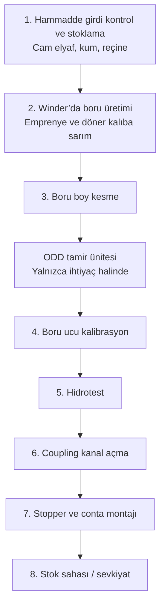
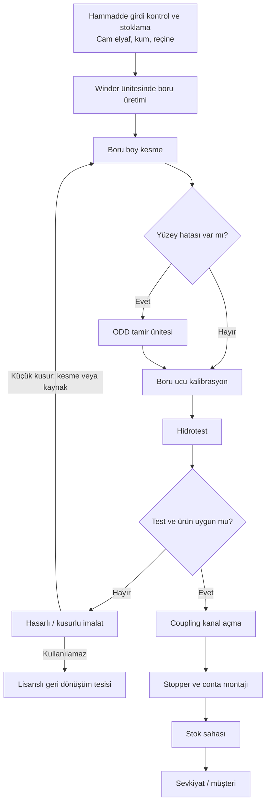
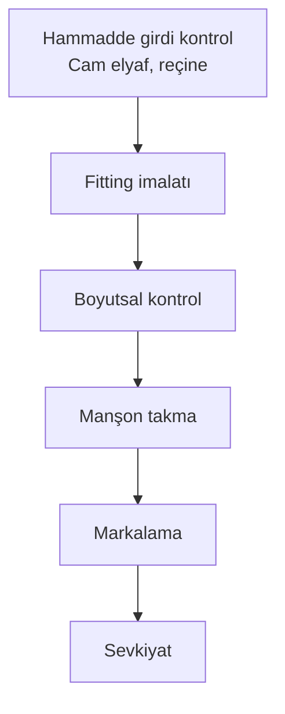

# Cam Elyaf Takviyeli Polyester Altyapı Boruları Üretim Faaliyeti

İş akım şeması ve proses özeti. Görsel belge: `is-akim-semasi.html` (tarayıcıda açın, yazdırarak PDF alabilirsiniz).

Üretim boyunca **su, hava ve elektrik** kullanılır.

---

## Şema A — Sade hat

İlk kez okuyan biri için ana yol. ODD tamir her boruda uygulanmaz.

---

## Şema B — Tam iş akışı (önerilen)

Şema A ile aynı hat; kalite kararları ve hasarlı ürün yolu eklenmiştir.

**Şemayı kalabalıklaştırmayan notlar**

- Hammadde kimya laboratuvarında, üretilen boru mekanik laboratuvarda doğrulanır.
- Geri dönüştürülebilir atık örnekleri: plastik/kâğıt ambalaj, CTP cürufu ve tozu, metal, tahta.
- Tehlikeli atık örnekleri: reçine ve kontamine malzeme, kontamine ambalaj, hidrolik yağ. Bunlar lisanslı bertaraf / geri kazanıma gider.

---

## Şema C — Fitting (ek parça) hattı

Aynı tesiste boruya paralel, daha kısa imalat. Bu hatta kum yoktur.

---

## Proses özeti versiyonları

Aynı süreç, farklı uzunlukta. Belgeye hangisi uyuyorsa onu kullanın; hepsi Şema B ile uyumludur.

### Versiyon 1 — 30 saniyelik özet

Tesise gelen cam elyaf, kum ve reçine kontrol edilip depolanır. Hammaddeler winder makinesinde döner kalıba sarılarak boru olur. Boru istenen boyda kesilir; yüzeyde küçük hata varsa tamir edilir. Uçlar kalibre edilir, boru su basıncıyla (hidrotest) sızdırmazlık ve dayanım için test edilir. Bağlantı için kanal açılır, stopper ve conta takılır. Uygun ürünler stok sahasına alınır. Küçük kusurlar onarılır; onarılamayanlar lisanslı geri dönüşüme gönderilir.

### Versiyon 2 — Detaylı proses özeti (önerilen)

Bu faaliyet, altyapıda kullanılan **cam elyaf takviyeli polyester (CTP / GRP) boruların** hammaddenin tesise girişinden sevkiyata kadar üretimini kapsar. Üretim tek bir hat üzerindedir. ODD tamir ünitesi her boruda çalışmaz; yalnızca yüzey hatası görüldüğünde devreye girer. Süreç boyunca su, hava ve elektrik kullanılır. Hammadde kalitesi kimya laboratuvarında, üretilen borunun mekanik özellikleri mekanik laboratuvarda doğrulanır.

1. **Hammadde girdi kontrol ve stoklama.** Tesise cam elyaf, kum ve reçine sevk irsaliyesi, kalite belgeleri ve teknik özelliklerle birlikte gelir. Ambalaj bütünlüğü, etiket bilgisi ve malzemenin siparişe uygunluğu kontrol edilir. Uygun bulunan hammaddeler belirlenen depolama alanlarına alınır; üretim planına göre stoklanır. Uygun bulunmayan malzeme üretime verilmez. Bu aşamada ambalaj kaynaklı plastik ve kâğıt atık oluşabilir.

2. **Winder ünitesinde boru üretimi.** Üretim sırasında reçine ve yardımcı malzemeler günlük tanklardan, cam elyaf raflardan winder ünitesine beslenir. Winder’da cam elyaf reçine ile emprenye edilir (ıslatılır) ve döner kalıp (mandrel) üzerine sarılır. Sarım hızı, reçine miktarı ve katman sayısı ayarlanarak boru istenen çap ve et kalınlığında şekillendirilir. Bu işlem filament winding / sarım yöntemidir. Şekillendirme sonrası boru, kesme öncesi kürlenmiş / üretim tamamlanmış halde kesme ünitesine alınır.

3. **Boru boy kesme.** Üretimi biten boru, müşteri veya standart talebine göre boy kesme ünitesine alınır. Kesim özel makinelerle yapılır. Amaç, boru uçlarının düzgün, çapak kontrolü yapılmış ve standart boyda olmasıdır. Bu adımda CTP cürufu ve CTP tozu oluşabilir; bunlar geri dönüştürülebilir atık olarak yönetilir.

4. **ODD tamir ünitesi (ihtiyaç halinde).** Kesme veya kalite kontrol sırasında yüzeysel hata (çizik, küçük yüzey bozukluğu vb.) tespit edilirse boru ODD tamir ünitesine alınır. Hatalı bölge uygun malzemeyle düzeltilir. Hata yoksa bu adım tamamen atlanır; hat üzerindeki zorunlu bir istasyon değildir.

5. **Boru ucu kalibrasyon.** Boru uçları kalibrasyon makinelerinde işlenerek montaja uygun çap, form ve ölçüye getirilir. Böylece sahada boruların birbirine ve manşona uyumlu bağlanması sağlanır. Kalibrasyon sırasında metal atık oluşabilir.

6. **Hidrotest.** Kalibre edilen boru su ile doldurulur ve belirli bir basınç altında teste tabi tutulur. Amaç sızdırmazlık ve dayanımı doğrulamaktır. Test süresince basınç kaybı, sızıntı ve deformasyon izlenir. Testi geçmeyen ürün hasarlı/kusurlu imalat yoluna alınır.

7. **Coupling kanal açma.** Testi uygun bulunan borunun uçlarına, manşon (coupling) yerleştirmek için özel makinelerle kanal açılır. Kanal derinliği ve ölçüsü montaj standardına uygun olmalıdır. Bu işlem, boruların sızdırmaz ve güvenli bağlanmasının ilk mekanik adımıdır.

8. **Stopper ve conta montajı.** Açılan kanallara sızdırmazlık elemanları (stopper ve conta) doğru konumda yerleştirilir. Contanın ezilmeden, kaçık durmadan oturması kontrol edilir. Bu adım, sahadaki birleştirmelerin sızdırmaması için son montaj hazırlığıdır.

9. **Stok sahasına sevk.** Tüm işlemleri ve kontrolleri tamamlanan borular stok sahasına taşınır. Borular ezilmeyecek ve işaretleri okunacak şekilde istiflenir. Sevkiyat planına göre müşteriye / son kullanıcıya gönderilmek üzere hazır tutulur. Stok ve sevkiyatta tahta ve metal ambalaj atıkları oluşabilir.

**Hasarlı / kusurlu imalat.** Yüzeysel çizik, çapak veya uç deformasyonu gibi küçük kusurlar kesme, kaynak veya benzeri uygulamalarla giderilerek ürün tekrar kullanılabilir hale getirilebilir; onarılan ürün uygun adımdan (genellikle boy kesme) hattına döner. Tesiste tekrar kullanılamayan hasarlı ürünler lisanslı geri dönüşüm tesislerine gönderilerek geri kazanılır.

**Fitting hattı (aynı tesis, ayrı kısa proses).** Ek parçalar cam elyaf ve reçine ile imal edilir (bu hatta kum yoktur). Fitting imalatını boyutsal kontrol, manşon takma, markalama ve sevkiyat izler.

**Atık notu.** Geri dönüştürülebilir: plastik/kâğıt ambalaj, CTP cürufu ve tozu, metal, tahta. Tehlikeli / özel yönetilen: reçine ve kontamine malzeme, kontamine ambalaj, hidrolik yağ. Bunlar lisanslı bertaraf veya geri kazanıma verilir.

### Versiyon 3 — Resmi belge metni

Üretim süreci kapsamında tesise temin edilen cam elyaf, kum ve reçine; sevk irsaliyesi ve kalite belgeleri eşliğinde girdi kontrolünden geçirilmekte, ambalaj bütünlüğü ile teknik özellikleri doğrulandıktan sonra uygun stok alanlarında depolanmaktadır. Hammadde kalitesi ihtiyaç halinde kimya laboratuvarında kontrol edilmektedir.

Üretim aşamasında reçine ve yardımcı malzemeler günlük tanklardan, cam elyaf ise raf sistemlerinden winder ünitesine beslenmektedir. Winder ünitesinde cam elyaf reçine ile emprenye edilerek döner kalıp üzerine sarım yöntemiyle istenilen çap ve et kalınlığında boru haline getirilmektedir. Üretimi tamamlanan borular, talep edilen standart boylara getirilmek üzere kesme ünitesinde boy kesme işlemine tabi tutulmakta; uçların düzgün ve standart ölçüde olması sağlanmaktadır.

Kalite kontrol sırasında yüzey hatası tespit edilmesi halinde borular ODD tamir ünitesine alınarak hatalı bölgeler uygun malzemelerle düzeltilmektedir. Tamir işlemi yalnızca ihtiyaç halinde uygulanmakta, hatasız ürünlerde bu adım atlanmaktadır. Ardından boru uçları kalibrasyon makinelerinde montaja uygun ölçü ve forma getirilmektedir. Kalibrasyonu tamamlanan borulara hidrotest uygulanmakta; borular su ile doldurularak belirli basınç altında sızdırmazlık, dayanım, basınç kaybı ve deformasyon açısından kontrol edilmektedir.

Testi uygun bulunan boruların uçlarına manşon yerleştirmek üzere coupling kanalı açılmakta, ardından stopper ve conta montajı gerçekleştirilmektedir. Tüm işlemleri tamamlanan borular sevkiyat öncesinde stok sahasına alınarak uygun yöntemlerle istiflenmekte ve sevkiyat planına göre hazır hale getirilmektedir. Üretim faaliyetinde su, hava ve elektrik kullanılmaktadır. Üretilen boruların mekanik özellikleri mekanik laboratuvarda doğrulanabilmektedir.

Yüzeysel çizik, çapak veya uç deformasyonu gibi küçük kusurlar kesme veya kaynak uygulamalarıyla giderilerek ürün tekrar kullanılabilir hale getirilebilmektedir. Tesiste değerlendirilemeyen hasarlı ürünler lisanslı geri dönüşüm tesislerine gönderilerek geri kazanımı sağlanmaktadır. Proses sırasında oluşan plastik, kâğıt, metal, tahta ile CTP cürufu ve tozu geri dönüştürülebilir atık olarak; reçine, kontamine malzeme/ambalaj ve hidrolik yağ atığı ise lisanslı tesislerde yönetilecek atık olarak ele alınmaktadır.

Aynı tesiste boru hattına paralel olarak fitting (ek parça) imalatı da yürütülmektedir. Fitting üretiminde cam elyaf ve reçine kullanılmakta; imalatı boyutsal kontrol, manşon takma, markalama ve sevkiyat adımları izlemektedir.

### Versiyon 4 — Adım kartları (detaylı)

**1. Hammadde girdi kontrol ve stoklama.** Tesise gelen cam elyaf, kum ve reçine sevk irsaliyesi ve kalite belgeleriyle karşılanır. Ambalaj bütünlüğü, etiket ve teknik özellikler siparişle karşılaştırılır. Uygun malzemeler belirlenen depolama alanlarına alınır ve üretim planına göre stoklanır. Uygunsuz malzeme üretime verilmez. Kimya laboratuvarı bu adımda girdi doğrulamasına destek olur.

**2. Winder’a besleme ve boru üretimi.** Reçine günlük tanklardan, cam elyaf raflardan winder ünitesine beslenir. Elyaf reçine ile emprenye edilip döner kalıp üzerine sarılır. Sarım ile boru istenen çap ve kalınlıkta şekillendirilir. Bu, hattın asıl imalat adımıdır.

**3. Boru boy kesme.** Üretimi tamamlanan boru, talep edilen boya göre kesme ünitesine alınır. Kesim özel makinelerle yapılır. Uçların düzgün, çapak kontrolü yapılmış ve standart ölçüde olmasına dikkat edilir.

**ODD tamir ünitesi (ihtiyaç halinde).** Üretim veya kalite kontrolde görülen küçük yüzey hataları bu ünitede giderilir. Hatalı bölge uygun malzemeyle düzeltilir. Tamir yalnızca gerekli görüldüğünde uygulanır; hata yoksa atlanır.

**4. Boru ucu kalibrasyon.** Boru uçları kalibrasyon makinelerinde işlenir. Uç çapı ve formu montaj standardına getirilir. Amaç, boruların sahada birbirine ve coupling’e uyumlu bağlanmasıdır.

**5. Hidrotest.** Boru su ile doldurulup belirli basınç altında tutulur. Sızdırmazlık ve dayanım bu testle doğrulanır. Basınç kaybı, sızıntı veya deformasyon varsa ürün uygun sayılmaz.

**6. Coupling kanal açma.** Testi geçen borunun uçlarına manşon yerleştirmek için kanal açılır. Kanal ölçüleri montaj standardına uygun olmalıdır. Bu adım sızdırmaz birleşmenin mekanik altyapısını hazırlar.

**7. Stopper ve conta montajı.** Açılan kanallara stopper ve conta doğru şekilde yerleştirilir. Sızdırmazlık elemanlarının konum ve oturması kontrol edilir. Sahadaki bağlantının sızdırmaması bu montaja bağlıdır.

**8. Stok sahasına sevk.** Montajı ve kalite kontrolü biten borular stok sahasına taşınır. Ezilmeyecek biçimde istiflenir. Sevkiyat planına göre müşteriye / son kullanıcıya gönderilmek üzere hazırlanır.

**Hasarlı / kusurlu imalat.** Çizik, çapak veya uç deformasyonu varsa kesme veya kaynakla ürün tekrar kullanılabilir; onarılan boru uygun proses adımına döner. Tesiste kullanılamayan hasarlı ürünler lisanslı geri dönüşüm tesislerine gönderilir.

---

## Eski şemalardan ne değişti?

| Konu | Önceki şemalar | Bu sürüm |
| --- | --- | --- |
| Ana hat | Yedi adımlık sade dikey şema | Aynı sıra korundu; adımlar kısaltıldı |
| ODD tamir | Metinde vardı, sade şemada yoktu | Kesik çerçeve / karar baklavası ile eklendi |
| Hasarlı imalat | Metinde vardı, sade şemada yoktu | Onarım veya lisanslı geri dönüşüm olarak eklendi |
| Atık ve laboratuvar | Detaylı şemada her kutudan dal | Ana şemadan çıkarıldı; alt notta toplandı |
| Fitting | Ayrı, daha kısa hat | Şema C olarak ayrı ve sade bırakıldı |
