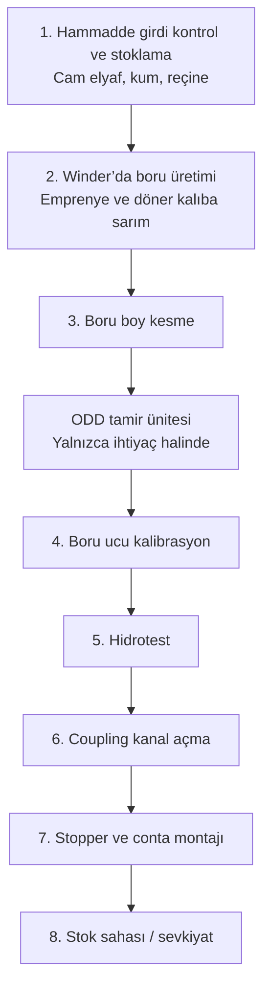
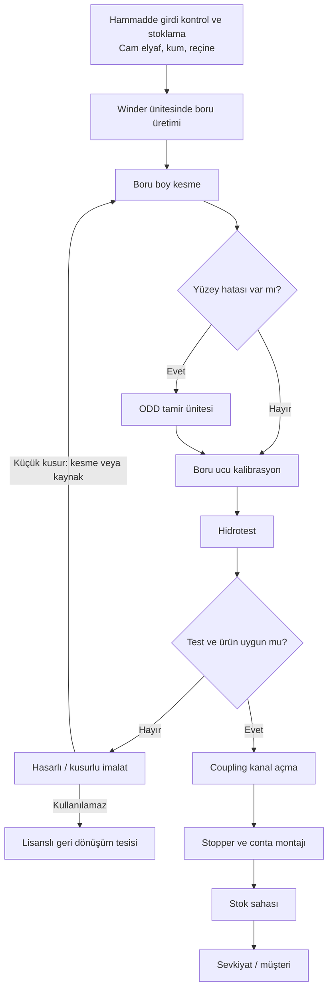
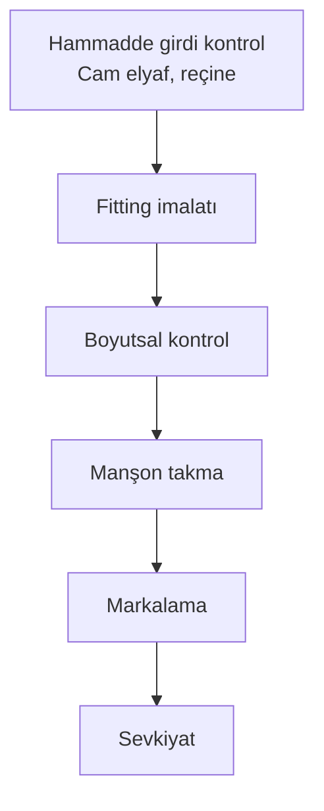

# Cam Elyaf Takviyeli Polyester Altyapı Boruları Üretim Faaliyeti

İş akım şeması ve proses özeti. Görsel belge: `is-akim-semasi.html` (tarayıcıda açın, yazdırarak PDF alabilirsiniz).

Üretim boyunca **su, hava ve elektrik** kullanılır.

---

## Şema A — Sade hat

İlk kez okuyan biri için ana yol. ODD tamir her boruda uygulanmaz.

---

## Şema B — Tam iş akışı (önerilen)

Şema A ile aynı hat; kalite kararları ve hasarlı ürün yolu eklenmiştir.

**Şemayı kalabalıklaştırmayan notlar**

- Hammadde kimya laboratuvarında, üretilen boru mekanik laboratuvarda doğrulanır.
- Geri dönüştürülebilir atık örnekleri: plastik/kâğıt ambalaj, CTP cürufu ve tozu, metal, tahta.
- Tehlikeli atık örnekleri: reçine ve kontamine malzeme, kontamine ambalaj, hidrolik yağ. Bunlar lisanslı bertaraf / geri kazanıma gider.

---

## Şema C — Fitting (ek parça) hattı

Aynı tesiste boruya paralel, daha kısa imalat. Bu hatta kum yoktur.

---

## Proses özeti versiyonları

Aynı süreç, farklı uzunlukta. Belgeye hangisi uyuyorsa onu kullanın; hepsi Şema B ile uyumludur.

### Versiyon 1 — 30 saniyelik özet

Tesise gelen cam elyaf, kum ve reçine kontrol edilip depolanır. Hammaddeler winder makinesinde döner kalıba sarılarak boru olur. Boru istenen boyda kesilir; yüzeyde küçük hata varsa tamir edilir. Uçlar kalibre edilir, boru su basıncıyla (hidrotest) sızdırmazlık ve dayanım için test edilir. Bağlantı için kanal açılır, stopper ve conta takılır. Uygun ürünler stok sahasına alınır. Küçük kusurlar onarılır; onarılamayanlar lisanslı geri dönüşüme gönderilir.

### Versiyon 2 — İlk kez okuyanlar için (önerilen)

Bu faaliyet, altyapıda kullanılan **cam elyaf takviyeli polyester (CTP / GRP) boruların** hammaddeden sevkiyata kadar üretimini anlatır. Süreç tek bir hat üzerindedir; tamir yalnızca ihtiyaç olursa yapılır.

1. **Malzeme gelir.** Cam elyaf, kum ve reçine sevk belgesi ve kalite evraklarıyla kontrol edilir. Ambalajı sağlam ve özellikleri uygun olanlar depoya alınır.
2. **Boru şekillenir.** Reçine günlük tanklardan, cam elyaf raflardan winder ünitesine verilir. Elyaf reçine ile ıslatılır (emprenye) ve dönen kalıba sarılır. Boru bu sarımla istenen çap ve kalınlığa gelir.
3. **Boyuna kesilir.** Bitmiş boru, siparişteki boya göre kesilir. Uçların düzgün olmasına bakılır.
4. **Gerekirse tamir edilir.** Küçük yüzey hataları ODD tamir ünitesinde düzeltilir. Hata yoksa bu adım atlanır.
5. **Uçlar ölçüye getirilir.** Kalibrasyon, boruların sahada birbirine uyumlu bağlanmasını sağlar.
6. **Basınç testi yapılır.** Boru su ile doldurulur, belirli basınca tabi tutulur. Sızıntı veya şekil bozukluğu aranır.
7. **Bağlantı hazırlanır.** Manşon (coupling) için kanal açılır; stopper ve conta takılır.
8. **Stoklanır.** Tamamlanan borular stok sahasına istiflenir, sevkiyata hazır hale gelir.

**Hasarlı ürün:** Çizik, çapak veya uç bozulması gibi küçük kusurlar kesme veya kaynakla giderilip ürün tekrar kullanılabilir. Tesiste kurtarılamayan ürünler lisanslı geri dönüşüm tesisine gönderilir.

### Versiyon 3 — Resmi belge paragrafı

Üretim süreci kapsamında tesise temin edilen cam elyaf, kum ve reçine girdi kontrolünden geçirilerek uygun stok alanlarında depolanmaktadır. Üretim aşamasında hammaddeler günlük tanklar ve raf sistemlerinden winder ünitesine beslenmekte; cam elyaf reçine ile emprenye edilerek döner kalıp üzerine sarım yöntemiyle boru haline getirilmektedir. Üretimi tamamlanan borular talep edilen standart boylara getirilmek üzere kesme ünitesinde işlenmektedir. Kalite kontrol sırasında ihtiyaç duyulması halinde yüzey hataları ODD tamir ünitesinde giderilmektedir. Ardından boru uçları kalibrasyon ile montaja uygun ölçülere getirilmekte ve hidrotest ile dayanım ile sızdırmazlık özellikleri kontrol edilmektedir. Testi uygun bulunan boruların uçlarına coupling kanalı açılmakta, stopper ve conta montajı yapılmaktadır. Tüm işlemleri tamamlanan borular sevkiyat öncesinde stok sahasına alınarak istiflenmektedir. Yüzeysel çizik, çapak veya uç deformasyonu gibi küçük kusurlar kesme veya kaynak uygulamalarıyla giderilerek ürün tekrar kullanılabilir hale getirilebilmektedir. Tesiste değerlendirilemeyen hasarlı ürünler lisanslı geri dönüşüm tesislerine gönderilerek geri kazanımı sağlanmaktadır.

### Versiyon 4 — Adım kartları

**Hammadde girdi kontrol ve stoklama.** Tesise gelen cam elyaf, kum ve reçine sevk irsaliyesi ve kalite belgeleriyle kontrol edilir. Ambalaj bütünlüğü ve teknik özellikler doğrulanır. Uygun bulunan malzemeler belirlenen depolama alanlarına alınır.

**Winder’a besleme ve boru üretimi.** Reçine ve yardımcı malzemeler günlük tanklardan, cam elyaf raflardan winder ünitesine beslenir. Cam elyaf reçine ile emprenye edilerek döner kalıp üzerine sarılır. Boru istenilen çap ve kalınlıkta şekillendirilir.

**Boru boy kesme.** Üretimi tamamlanan borular talep edilen boylara göre kesilir. Uçların düzgün ve standart ölçülerde olmasına dikkat edilir.

**ODD tamir ünitesi (ihtiyaç halinde).** Küçük yüzey hataları bu ünitede giderilir. Tamir yalnızca gerekli görüldüğünde uygulanır.

**Boru ucu kalibrasyon.** Boru uçları kalibrasyon makinelerinde işlenerek montaja uygun ölçülere getirilir.

**Hidrotest.** Borular su ile doldurularak belirli bir basınç altında teste tabi tutulur. Sızdırmazlık, dayanım, basınç kaybı ve deformasyon kontrol edilir.

**Coupling kanal açma.** Boru uçlarına manşon yerleştirmek için kanal açılır. Kanal ölçüleri montaj standartlarına uygun olmalıdır.

**Stopper ve conta montajı.** Coupling kanallarına sızdırmazlık elemanları yerleştirilir. Bu işlem bağlantının sızdırmamasını sağlar.

**Stok sahasına boru sevki.** Kontrolleri tamamlanan borular stok sahasına taşınır, istiflenir ve sevkiyat planına göre hazırlanır.

**Hasarlı / kusurlu imalat.** Yüzeysel çizik, çapak veya uç deformasyonu varsa kesme veya kaynakla ürün tekrar kullanılabilir. Tesiste kullanılamayan hasarlı ürünler lisanslı geri dönüşüm tesislerine gönderilir.

---

## Eski şemalardan ne değişti?

| Konu | Önceki şemalar | Bu sürüm |
| --- | --- | --- |
| Ana hat | Yedi adımlık sade dikey şema | Aynı sıra korundu; adımlar kısaltıldı |
| ODD tamir | Metinde vardı, sade şemada yoktu | Kesik çerçeve / karar baklavası ile eklendi |
| Hasarlı imalat | Metinde vardı, sade şemada yoktu | Onarım veya lisanslı geri dönüşüm olarak eklendi |
| Atık ve laboratuvar | Detaylı şemada her kutudan dal | Ana şemadan çıkarıldı; alt notta toplandı |
| Fitting | Ayrı, daha kısa hat | Şema C olarak ayrı ve sade bırakıldı |
