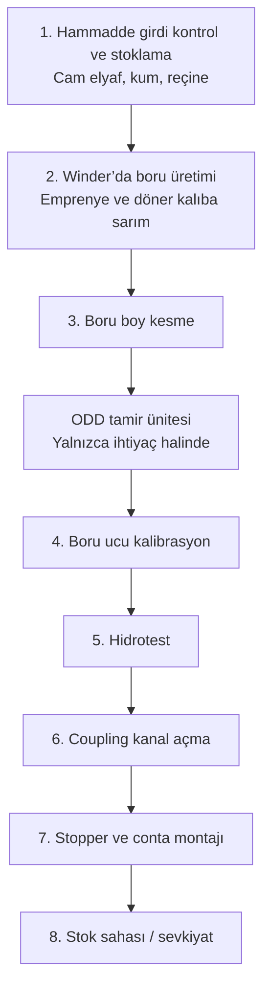
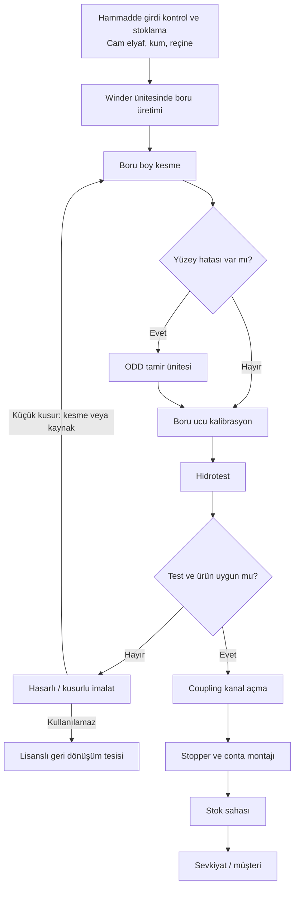
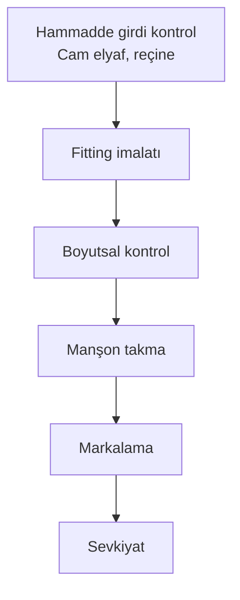

# Cam Elyaf Takviyeli Polyester Altyapı Boruları Üretim Faaliyeti

İş akım şeması ve proses özeti. Görsel belge: `is-akim-semasi.html` (tarayıcıda açın, yazdırarak PDF alabilirsiniz).

Üretim boyunca **su, hava ve elektrik** kullanılır.

---

## Şema A — Sade hat

İlk kez okuyan biri için ana yol. ODD tamir her boruda uygulanmaz.

---

## Şema B — Tam iş akışı (önerilen)

Şema A ile aynı hat; kalite kararları ve hasarlı ürün yolu eklenmiştir.

**Şemayı kalabalıklaştırmayan notlar**

- Hammadde kimya laboratuvarında, üretilen boru mekanik laboratuvarda doğrulanır.

---

## Şema C — Fitting (ek parça) hattı

Aynı tesiste boruya paralel, daha kısa imalat. Bu hatta kum yoktur.

---

## Proses özeti — ünite ünite

Bu faaliyet, altyapıda kullanılan cam elyaf takviyeli polyester (CTP / GRP) boruların hammaddenin tesise girişinden sevkiyata kadar üretimini kapsar. Üretim tek hat üzerindedir. ODD tamir ünitesi her boruda çalışmaz; yalnızca ihtiyaç halinde devreye girer. Süreç boyunca su, hava ve elektrik kullanılır.

### 1. Hammadde girdi kontrol ve stoklama ünitesi

Tesise cam elyaf, kum ve reçine sevk irsaliyesi ve kalite belgeleri ile birlikte gelir. Bu ünitede malzemenin siparişe uygunluğu, ambalaj bütünlüğü, etiket bilgisi ve teknik özellikleri kontrol edilir. Gerek duyulduğunda numune kimya laboratuvarına alınarak hammadde kalitesi doğrulanır. Uygun bulunan hammaddeler belirlenen depolama alanlarına alınır; reçine, cam elyaf ve kum birbirine karışmayacak ve üretim planına göre kolay çekilebilecek şekilde stoklanır. Uygun bulunmayan malzeme üretime verilmez. Stoklanan malzeme, günlük üretim ihtiyacına göre sonraki üniteye (winder) sevk edilir.

### 2. Winder ünitesi (boru üretimi)

Bu ünite hattın asıl imalat noktasıdır. Reçine ve yardımcı malzemeler günlük tanklardan, cam elyaf raflardan winder makinesine beslenir. Winder’da cam elyaf reçine ile emprenye edilir (elyaf reçineye doyurulur) ve döner kalıp (mandrel) üzerine katman katman sarılır. Kum, boru yapısına reçine ile birlikte verilir. Sarım hızı, reçine miktarı ve katman sayısı ayarlanarak boru istenen çap ve et kalınlığında şekillendirilir. Üretimi tamamlanan boru kalıptan alınarak boy kesme ünitesine aktarılır.

### 3. Boru boy kesme ünitesi

Winder’dan çıkan boru, müşteri siparişindeki veya ilgili standarttaki boya getirilmek üzere kesme ünitesine alınır. Kesim özel kesme makineleriyle yapılır. Bu ünitede amaç, borunun doğru boyda olması ve uçların düzgün, çapak kontrolü yapılmış halde bir sonraki işleme hazırlanmasıdır. Boy ve uç kontrolü uygunsa boru kalibrasyona; yüzeyde küçük hata varsa ODD tamir ünitesine yönlendirilir.

### 4. ODD tamir ünitesi (ihtiyaç halinde)

Bu ünite sürekli çalışan bir istasyon değildir. Üretim veya kalite kontrol sırasında yüzeysel çizik, küçük yüzey bozukluğu gibi hatalar görülürse boru buraya alınır. Hatalı bölge uygun tamir malzemeleriyle düzeltilir. Tamir yalnızca gerekli görüldüğünde uygulanır. Yüzey uygunsa boru kalibrasyon ünitesine geçer.

### 5. Boru ucu kalibrasyon ünitesi

Boru uçları kalibrasyon makinelerinde işlenerek montaja uygun çap, form ve ölçüye getirilir. Amaç, sahada boruların birbirine ve manşona (coupling) boşluksuz ve standart biçimde bağlanabilmesidir. Uç ölçüleri kalite standardına uygun hale geldikten sonra boru hidrotest ünitesine alınır.

### 6. Hidrotest ünitesi

Kalibre edilen boru su ile doldurulur ve belirli bir basınç altında teste tabi tutulur. Bu ünitede sızdırmazlık ve mekanik dayanım kontrol edilir. Test süresince basınç kaybı, sızıntı ve deformasyon olup olmadığı izlenir. Testi geçen boru coupling kanal açma ünitesine alınır. Testi geçmeyen veya kusurlu görülen ürün, hasarlı/kusurlu imalat değerlendirmesine yönlendirilir. Gerekli görülen mekanik kontroller mekanik laboratuvarda da yapılabilir.

### 7. Coupling kanal açma ünitesi

Hidrotesti uygun bulunan borunun uçlarına, manşon yerleştirmek için özel makinelerle kanal açılır. Kanalın yeri, derinliği ve ölçüsü montaj standardına uygun olmalıdır. Bu işlem, boruların sızdırmaz ve güvenli bağlanmasının mekanik altyapısını hazırlar. Kanal kontrolü tamamlanan boru stopper ve conta montaj ünitesine geçer.

### 8. Stopper ve conta montaj ünitesi

Açılan coupling kanallarına sızdırmazlık elemanları (stopper ve conta) yerleştirilir. Contanın doğru yuvaya, ezilmeden ve kaçık durmadan oturması kontrol edilir. Bu ünite, sahadaki birleştirmelerin sızdırmaması için son montaj hazırlığıdır. Montajı tamamlanan boru stok sahasına alınır.

### 9. Stok sahası ve sevkiyat

Tüm üretim, test ve montaj işlemleri biten borular stok sahasına taşınır. Borular ezilmeyecek, yuvarlanmayacak ve işaretleri okunacak şekilde istiflenir. Sevkiyat planına göre müşteriye / son kullanıcıya gönderilmek üzere hazır tutulur.

### 10. Hasarlı / kusurlu imalat değerlendirmesi

Yüzeysel çizik, çapak veya uç deformasyonu gibi küçük kusurlar varsa kesme veya kaynak uygulamalarıyla ürün tekrar kullanılabilir hale getirilir. Onarılan boru uygun üniteden (genellikle boy kesme) hatta geri alınır. Tesiste tekrar kullanılamayan hasarlı ürünler lisanslı geri dönüşüm tesislerine gönderilir.

### Fitting ünitesi (ayrı hat)

Aynı tesiste boruya paralel, daha kısa bir imalat hattı vardır. Fitting (ek parça) üretiminde cam elyaf ve reçine kullanılır; bu hatta kum yoktur. Fitting imalatını boyutsal kontrol, manşon takma, markalama ve sevkiyat izler.

---

### Resmi belge metni (ünite sırasıyla)

Üretim süreci kapsamında tesise temin edilen cam elyaf, kum ve reçine; sevk irsaliyesi ve kalite belgeleri eşliğinde girdi kontrol ünitesinde kontrol edilmekte, ambalaj bütünlüğü ile teknik özellikleri doğrulandıktan sonra uygun stok alanlarında depolanmaktadır. Hammadde kalitesi ihtiyaç halinde kimya laboratuvarında doğrulanmaktadır.

Üretim, winder ünitesinde gerçekleştirilmektedir. Reçine ve yardımcı malzemeler günlük tanklardan, cam elyaf raf sistemlerinden winder’a beslenmekte; cam elyaf reçine ile emprenye edilerek döner kalıp üzerine sarım yöntemiyle istenilen çap ve et kalınlığında boru haline getirilmektedir. Üretimi tamamlanan borular boy kesme ünitesinde talep edilen standart boylara getirilmekte, uçların düzgün ve standart ölçüde olması sağlanmaktadır.

Kalite kontrol sırasında yüzey hatası tespit edilmesi halinde borular ODD tamir ünitesine alınmakta; hatalı bölgeler uygun malzemelerle düzeltilmektedir. Tamir yalnızca ihtiyaç halinde uygulanmakta, hatasız ürünlerde bu ünite atlanmaktadır. Ardından boru uçları kalibrasyon ünitesinde montaja uygun ölçü ve forma getirilmektedir. Kalibrasyonu tamamlanan borular hidrotest ünitesinde su ile doldurularak belirli basınç altında sızdırmazlık ve dayanım açısından kontrol edilmektedir.

Testi uygun bulunan borular coupling kanal açma ünitesinde manşon yuvası açılmakta, stopper ve conta montaj ünitesinde sızdırmazlık elemanları yerleştirilmektedir. Tüm işlemleri tamamlanan borular stok sahasına alınarak istiflenmekte ve sevkiyat planına göre hazır hale getirilmektedir. Üretim faaliyetinde su, hava ve elektrik kullanılmaktadır. Üretilen boruların mekanik özellikleri mekanik laboratuvarda doğrulanabilmektedir.

Yüzeysel çizik, çapak veya uç deformasyonu gibi küçük kusurlar kesme veya kaynak uygulamalarıyla giderilerek ürün tekrar kullanılabilir hale getirilebilmektedir. Tesiste değerlendirilemeyen hasarlı ürünler lisanslı geri dönüşüm tesislerine gönderilmektedir. Aynı tesiste fitting imalatı cam elyaf ve reçine ile ayrı bir hatta yürütülmekte; imalatı boyutsal kontrol, manşon takma, markalama ve sevkiyat izlemektedir.

---

## 5.1 Hava emisyonları

Tesiste hava emisyonu kaynağı olarak **4 adet proses bacası** bulunmaktadır. Yakma bacası, proses dışı baca ve alan kaynağı bulunmamaktadır. Bacalar yerden 15 m, çatıdan 2,5 m yüksekliktedir. Bacalarda sürekli (online) izleme sistemi yoktur. Tesis, Çevre İzin ve Lisans Yönetmeliği kapsamında hava emisyonu konulu çevre izin / lisans belgesi yenileme sürecindedir. Baca teknik bilgileri, Sanayi Kaynaklı Hava Kirliliğinin Kontrolü Yönetmeliği (SKHKKY) çerçevesinde yapılacak emisyon ölçümleri sonrasında güncellenecektir.

**HB1 — Stiren emiş bacası 1.** CTP boru üretim (winder) ünitesine hizmet eder. Proses emisyonu (stiren) bu baca ile tahliye edilir. Bu bacada toz toplama sistemi bulunmamaktadır.

**HB2 — Kalibrasyon proses bacası.** CTP boru ucu kalibrasyon ünitesine hizmet eder. Proses emisyonudur. Bu baca toz toplama sistemi ile çalışır: işlem sırasında oluşan toz emişle çekilir, borularla taşınır ve çuvallarda toplanır.

**HB3 — ODD tamir proses bacası.** CTP boru ODD tamir ünitesine hizmet eder. Proses emisyonudur. Bu baca toz toplama sistemi ile çalışır: oluşan toz emişle çekilir, borularla taşınır ve çuvallarda toplanır.

**HB4 — Kaplin (coupling) kanal açma proses bacası.** Coupling kanal açma ünitesine hizmet eder. Proses emisyonudur. Bu baca toz toplama sistemi ile çalışır: oluşan toz emişle çekilir, borularla taşınır ve çuvallarda toplanır.

Özetle; stiren emiş bacası (HB1) hariç diğer üç proses bacası (HB2, HB3, HB4) toz toplama sistemi ile donatılmıştır. Toz, kaynakta emilerek boru hattı üzerinden çuvallara alınmakta, böylece ilgili ünitelerden atmosfere toz salımı azaltılmaktadır.

### Resmi başvuru paragrafı

Tesiste emisyon kaynağı niteliğinde 4 adet proses bacası mevcut olup yakma bacası, proses dışı baca ve alan kaynağı bulunmamaktadır. HB1 stiren emiş bacası CTP boru üretim ünitesine hizmet etmekte olup proses emisyonunu tahliye etmektedir; bu bacada toz toplama sistemi bulunmamaktadır. HB2 kalibrasyon proses bacası, HB3 ODD tamir proses bacası ve HB4 kaplin kanal açma proses bacası ilgili ünitelere hizmet eden proses bacalarıdır. Stiren bacası hariç söz konusu üç baca toz toplama sistemi ile çalışmakta; ünite çıkışında oluşan tozlar emiş sistemiyle çekilerek borular vasıtasıyla çuvallara alınmaktadır. Bacaların yerden yüksekliği 15 m, çatıdan yüksekliği 2,5 m olup sürekli izleme sistemi bulunmamaktadır. Hava emisyonu konulu çevre izin ve lisans belgesi yenileme işlemleri Çevre İzin ve Lisans Yönetmeliği kapsamında yürütülmekte; baca teknik bilgileri SKHKKY çerçevesinde gerçekleştirilecek emisyon ölçümleri sonrasında güncellenecektir.

---

## Eski şemalardan ne değişti?

| Konu | Önceki şemalar | Bu sürüm |
| --- | --- | --- |
| Ana hat | Yedi adımlık sade dikey şema | Aynı sıra korundu |
| ODD tamir | Metinde vardı, sade şemada yoktu | Şemaya ve ünite açıklamasına eklendi |
| Hasarlı imalat | Metinde vardı, sade şemada yoktu | Onarım veya lisanslı geri dönüşüm olarak eklendi |
| Fitting | Ayrı, daha kısa hat | Şema C ve ayrı ünite olarak bırakıldı |
